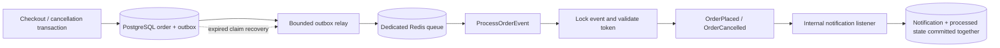

# Bonus Milestone 7C — Order Events and Background Queues

## Proposed design recorded before implementation

Checkout/cancellation will insert a UUID-identified OrderPlaced/OrderCancelled envelope into a PostgreSQL transactional outbox inside their existing business transaction. The immutable context is order ID, event type and occurred-at timestamp. Existing replay/repeated-cancellation early returns will create no event. A unique order/type constraint adds database protection. No queue connection or synchronous external listener will run during the purchase/cancellation transaction.

A bounded Artisan relay will claim due pending/expired queued rows using FOR UPDATE SKIP LOCKED in a short transaction, assign a new UUID ownership token, increment dispatch attempts and set an expiring dispatch lease. After commit it will enqueue an ID/token-only ProcessOrderEvent job on an independent named Redis queue/connection. Queue push failure will release the unsent claims with delayed retry and sanitized diagnostics. A crash after claiming or uncertain Redis acceptance will be recoverable through lease expiry; dispatch is at least once, never exactly once.

A processor will lock only its outbox row, verify the current token/state, dispatch the corresponding Laravel event to a discovered synchronous internal listener, persist an order-notification/audit result unique by event ID, and mark processed in the same short PostgreSQL transaction. Duplicate, stale-token and already-processed jobs will do nothing. Events describe already committed order operations; asynchronous jobs will never change order status, inventory or promotion usage. The listener performs only local persistence; external work is outside this milestone.

Laravel workers will use bounded attempts/backoff and timeout shorter than retry_after. Exceptions will roll back result/completion together and record sanitized processing failure metadata separately. Exhausted jobs will mark only the still-owned event failed; manual outbox retry will reset ownership and schedule a new job. Expired leases recover killed workers/lost queue entries. Native failed_jobs retains queue failures. At-least-once queue delivery plus transactional uniqueness gives effectively-once internal effects.

The existing Redis server is disposable and uses eviction. Separate connection/database/queue namespaces will isolate queue keys from catalogue keys; PostgreSQL outbox leases remain the durability boundary if Redis loses jobs. Opt-in Compose worker/scheduler services will poll/consume only this project. No extra messaging dependencies or public endpoints are planned.

Verification will cover PostgreSQL transaction rollback/replay, real Redis enqueue/worker execution, transient/exhausted failures, recovery, stale ownership, multiple independent claim/processing workers, existing contention/regression suites, and quality checks. Exact results and final operating instructions will be added after execution.

## Implemented architecture

`CheckoutService` and `OrderService` retain their transactions, PostgreSQL lock order and retry handling. They call `OrderOutboxService::record()` near the end of a successful write path. Recording requires an open transaction. No event listener or queue push runs at this boundary. Existing checkout replay and repeated cancellation return before recording.

`OrderOutboxRepositoryInterface` / `EloquentOrderOutboxRepository` own event/result persistence. `OrderOutboxService` handles recording, claiming/relay, inspection and manual retry. `OrderEventProcessingService` owns the worker transaction. `ProcessOrderEvent` contains only an event UUID and a dispatch ownership UUID. Laravel discovers `RecordOrderNotification::handle(OrderPlaced|OrderCancelled)` for both immutable application events; `php artisan event:list` verifies discovery.



These events describe operations that already committed. They contain `eventId`, `orderId` and an immutable UTC `occurredAt`; no customer data, tokens, product lists or serialized Order models. `order_notifications` is an internal audit/notification inbox recording which committed operation has been processed. It does not imply email, payment, shipping or public notification delivery. No new public routes or Postman changes are required.

## Lifecycle, transaction boundaries and concurrency

1. Business transaction inserts a `pending` envelope with a fresh event UUID and due timestamp. Order/type uniqueness prevents a second event for the same one-time transition.
2. `orders:dispatch-outbox` refuses an enclosing transaction and synchronous/null/failover queue drivers. It claims at most the configured batch (hard maximum 1,000) in one short PostgreSQL transaction using `FOR UPDATE SKIP LOCKED`, deterministic due/UUID order and a new dispatch token. Status becomes `queued`, dispatch count increases and the lease expires after 300 seconds by default.
3. After the claim commits, the relay pushes ID/token jobs. Redis operations are outside every database transaction. A push exception releases this and remaining unsent claims back to `pending`, clears ownership, sets a 15-second retry delay and records only the exception class. Already-pushed events retain their leases. An uncertain push acknowledgement can produce an old duplicate, which ownership checks reject.
4. A worker locks its outbox row in a short transaction. Missing events, non-queued events and stale tokens are acknowledged without an effect. The current owner dispatches the Laravel event; its synchronous listener inserts the notification, then the processor updates completion and attempt count. Both writes commit together. No network call runs inside this transaction.
5. Ordinary processing exceptions roll back both writes, then increment the durable attempt counter and save the exception class in a separate guarded update. Laravel releases the job with backoff. Job exhaustion/timeout invokes the guarded `failed()` hook and native failed-job storage.
6. An expired queued lease is eligible for a fresh claim/token. This recovers a relay dying after claim, lost/evicted Redis jobs, and killed workers. A worker already holding the event row cannot be overtaken by a claimant, which skips its lock. A late old failure cannot overwrite a newer claim or processed result.
7. Failed events require explicit operator retry. `orders:retry-outbox EVENT_UUID` resets failed/pending/expired events, failure markers, processing attempts and ownership. It refuses processed events and active leases. The next relay assigns a fresh token. Dispatch count remains cumulative.

Purchase lock order remains Cart → Products ascending ID → Promotion; cancellation remains Order → Products ascending ID. Workers never restore/deduct inventory, change order status, clear carts or alter promotion ledgers. Processing only locks the outbox row, apart from normal FK checks on inserting the local result. PostgreSQL remains authoritative for purchases and durable effects.

Delivery is **at least once**. PostgreSQL row locking, ownership checks, the unique result event ID and the result/completion transaction provide **effectively-once internal effects**, not exactly-once message delivery. Event ordering is not guaranteed: a cancellation audit entry can be processed before its placement entry. Consumers must treat them as immutable historical operations.

## Database schema

Both additive migrations run after the existing order/cancellation migrations; no order columns are changed or historical events backfilled.

| Table / field | Purpose and constraints |
| --- | --- |
| `order_outbox_events.id` | UUID primary key, stable across every delivery |
| `order_id`, `event_type`, `occurred_at` | Restrictive order FK; allowed placed/cancelled types; unique `(order_id, event_type)`; immutable envelope |
| `status`, `dispatch_token` | Pending/queued/processed/failed CHECK; pending has no token, all other states have ownership |
| `available_at`, `last_dispatched_at` | Microsecond UTC due/lease expiry and last claim time |
| `dispatch_attempts`, `processing_attempts` | Non-negative database CHECKs; dispatch count cumulative, processing count resets only on manual retry |
| `processed_at`, `failed_at`, `last_error` | Completion/failure markers constrained to their status; sanitized exception class or fixed diagnostic |
| `created_at`, `updated_at` | Microsecond timezone-aware audit timestamps |
| `order_outbox_due_idx` | Partial `(available_at, id)` index for pending/queued rows |
| `order_notifications` | ID, unique restrictive event FK, restrictive order FK, type/occurred-at and timestamps; `(order_id, created_at)` index |

Due comparisons preserve microsecond precision instead of relying on Laravel's default whole-second query binding. Retained notifications/outbox events restrict deletion of their parent records. This milestone does not add automatic retention/deletion or expose audit records over HTTP. Migration downgrade drops the notification table before the outbox table and removes this milestone's audit history; never use rollback as an operational retry mechanism.

## Queue and worker configuration

| Setting | Default / behavior |
| --- | --- |
| `ORDER_EVENTS_QUEUE_CONNECTION` | `order-redis`; a dedicated Laravel queue connection; Redis and database asynchronous drivers supported |
| `ORDER_EVENTS_QUEUE` | `order-events-APP_ENV` natively; Compose supplies `order-events-local` unless overridden |
| `ORDER_EVENTS_REDIS_DB` | DB 4 locally; PHPUnit and child worker guards require DB 5 |
| `ORDER_EVENTS_REDIS_URL` | Optional private Redis/TLS URL; unset locally and forced empty in tests |
| `ORDER_EVENTS_LEASE_SECONDS` | 300; minimum 180 to exceed normal retry lifecycle |
| `ORDER_EVENTS_DISPATCH_RETRY_SECONDS` | 15; minimum 1 |
| `ORDER_EVENTS_BATCH_SIZE` | 100; clamped 1–1,000; CLI `--limit` validates the same range |
| Dedicated Redis client | 0.5-second connect timeout, 5-second read timeout, no client reconnect retries |
| `order-redis` queue | Redis connection `order-events`, `retry_after=90`, `block_for=2`, `after_commit=true` |
| `ProcessOrderEvent` | 3 tries, backoff 5/30 seconds, timeout 30 seconds, fail on timeout |
| Durable processing bound | Refuses execution once 3 attempts are already recorded across automatic redelivery; manual retry resets the count |
| Native failed-job provider | Existing `database-uuids` provider and `failed_jobs` table |

Job timeout is shorter than Redis reservation expiry. Three normal attempts plus backoff fit comfortably within the default lease; backlog can exceed the lease and cause additional delivery, which remains safe. SIGTERM can be observed during the two-second Redis block. Compose grants the queue worker 45 seconds for shutdown, above the 30-second job timeout. The scheduler has 75 seconds to drain its current minute of sub-minute tasks. Worker process recycling uses `--max-time=3600 --memory=128` with restart policy. Changing code requires worker restart; rebuilding cached configuration must accompany environment changes.

The existing Redis instance remains private, without a published port, persistence or volume. DBs isolate keys (catalogue DB 2/3, queue DB 4/5), **not memory, eviction or server outages**. Its 128 MB allkeys-lru policy can evict queue keys. PostgreSQL leases recover lost jobs; production should generally use a separate authenticated queue Redis with suitable persistence and no-eviction policy. A private `ORDER_EVENTS_REDIS_URL` can point the dedicated connection there without changing catalogue configuration. Do not apply server changes to unrelated projects or `postgres-local`.

## Local setup and operations

For an existing 7B checkout:

```bash
docker compose exec -T api php artisan migrate --no-interaction
# Only if configuration was cached:
docker compose exec -T api php artisan config:clear --no-interaction
docker compose exec -T api php artisan event:list --no-interaction
docker compose exec -T api php artisan schedule:list --no-interaction
# Opt-in services; migrations must be applied first:
docker compose --profile orders up -d --no-deps order-worker order-scheduler
docker compose --profile orders logs --tail=100 order-worker order-scheduler
# Graceful shutdown of only the opt-in services:
docker compose --profile orders stop order-worker order-scheduler
```

The `orders` profile shares the API image, bind mount and project database/network; it publishes no ports and does not run migrations automatically. It is absent from the default Compose startup. The scheduler runs `schedule:work` and relays a finite batch every ten seconds; claims coordinate multiple relays, so a Redis/cache-based scheduler singleton lock is unnecessary.

Without the Compose profile, use two terminals:

```bash
docker compose exec -T api php artisan schedule:work --no-interaction
docker compose exec -T api php artisan queue:work order-redis \
  --queue=order-events-local --sleep=1 --tries=3 --timeout=30 --max-time=3600 --memory=128 --no-interaction
# Or one bounded relay/worker pass:
docker compose exec -T api php artisan orders:dispatch-outbox --limit=100 --no-interaction
docker compose exec -T api php artisan queue:work order-redis \
  --queue=order-events-local --once --sleep=0 --tries=3 --timeout=30 --no-interaction
```

Use the configured queue name/connection if overridden. An asynchronous database queue is supported as an explicit alternative by configuring `ORDER_EVENTS_QUEUE_CONNECTION=database` and the same worker connection; its default 90-second retry_after should remain above the job timeout. Redis is the verified default, not an automatic fallback. A default `queue:work` with this project's general `QUEUE_CONNECTION=database` will not consume `order-redis`.

```bash
docker compose exec -T api php artisan orders:outbox --status=pending --limit=100 --no-interaction
docker compose exec -T api php artisan orders:outbox --status=queued --limit=100 --no-interaction
docker compose exec -T api php artisan orders:outbox --status=failed --limit=100 --no-interaction
docker compose exec -T api php artisan queue:failed --no-interaction
docker compose exec -T api php artisan orders:retry-outbox EVENT_UUID --no-interaction
docker compose exec -T api php artisan orders:dispatch-outbox --no-interaction
# Optional operator retention for native failures after diagnosis:
docker compose exec -T api php artisan queue:prune-failed --hours=168 --no-interaction
```

Inspect queued lease expiry before declaring a job stuck. Expired work is reclaimed automatically; an active lease cannot be stolen by manual retry. Queue dispatch failure returns a nonzero CLI exit, emits a class-only diagnostic, releases unsent claims and preserves orders. Application warning logs are limited to one per queue connection/minute per local filesystem; command summaries remain one per bounded invocation. Outbox metadata never includes exception messages, connection URLs, credentials, customer data or auth tokens. Native `failed_jobs` retains Laravel's serialized ID/token payload and full exception/stack for restricted operator diagnosis; restrict database/log access and prune failures according to your policy.

Prefer **outbox retry** for failed order events. Native `queue:retry` alone leaves the failed outbox state/token unchanged and its job is safely ignored. Old failed-job records remain historical until explicitly forgotten/pruned. Never reset a processed event or delete its result to replay an effect.

## Automated verification

All database suites run sequentially against guarded `ecommerce_order_api_test` on the project's PostgreSQL host. The tests never migrate or reset development data. Real queue tests use Redis DB 5, a fresh UUID queue per case, and delete only that queue's keys through Laravel's clear operation; no FLUSHDB/FLUSHALL. Child workers refuse unexpected PostgreSQL/Redis targets.

```bash
docker compose exec -T api php artisan test --compact \
  tests/Feature/Services/Order/OrderOutboxServiceTest.php \
  tests/Feature/Jobs/ProcessOrderEventTest.php \
  tests/Feature/Services/Order/OrderOutboxConcurrencyTest.php \
  tests/Feature/Models/OrderEventPersistenceTest.php \
  tests/Feature/Services/Checkout/CheckoutServiceTest.php \
  tests/Feature/Services/Order/OrderServiceTest.php
docker compose exec -T api php artisan test --compact
# Standalone new contention cases:
docker compose exec -T api php artisan test --compact tests/Feature/Services/Order/OrderOutboxConcurrencyTest.php
# Existing standalone contention cases: README lists all five paths.
docker compose exec -T api vendor/bin/pint --dirty --format agent
docker compose exec -T api composer validate --strict
docker compose exec -T api composer audit
docker compose config --quiet
git diff --check
```

Coverage includes successful envelopes/replays; enclosing rollback; outbox-write rollback of inventory, orders, cart and redemption; existing creation/item/stock/redemption/cancellation write failures; unique event/result constraints and invalid tracking states; real Redis relay/worker processing for both types; duplicate execution; stale failure hooks; transient retry with rolled-back listener effects; native exhausted jobs and manual recovery; real refused TCP queue connection and recovery; lost jobs/claim recovery; bounded batches; invalid synchronous configuration; and a processor killed while its notification is uncommitted.

Separate-process PostgreSQL evidence proves two live transactions hold disjoint claim batches while skipping a parent-locked row, and proves two distinct PostgreSQL PIDs are simultaneously blocked on the same outbox row before both processors are released. Exactly one internal result persists. Synchronization observes explicit output/lock barriers with bounded polling; arbitrary sleep timing is not the proof. Injected SQLSTATE retries in existing suites remain separate from observed contention evidence.

Executed evidence and the final file/Git inventory follow below.

## Reliability limits and trade-offs

- This is a focused two-event outbox, not a generic messaging framework. Existing dependencies and public contracts are unchanged; no Horizon or external providers were added.
- The local listener must stay synchronous and perform transactional local persistence only. Future email/webhook/payment effects need their own durable idempotency protocol and must not be inserted into this database transaction.
- Durable outbox state depends on PostgreSQL availability/backups. Broker loss may delay processing until lease expiry, but cannot lose the committed envelope. Claim release can also fail during a simultaneous database outage; the durable lease is the recovery path.
- Relays retry broker outages through later bounded scheduled invocations indefinitely so committed events are not abandoned. Each native job has three tries, and redelivery refuses execution once three processing attempts are recorded. Concurrent failing copies can roll back before their separate failure counters commit, so that counter may exceed three; killed processes may die before a counter can commit. Dispatch count and lease timestamps expose repeated recovery.
- Cross-process clocks should be synchronized for lease decisions. A very large backlog can redeliver before an earlier copy starts; ownership fences make old copies no-ops. There is no ordering guarantee, external exactly-once claim, throughput benchmark or production monitoring dashboard.
- Tables/failure history have no automatic retention in this milestone. Query limits/batch limits bound each operation; operators must monitor backlog/failed events and choose retention before long-term production use.
- Native failed-job retention and the sanitized outbox serve different diagnostic purposes. Manual outbox retry resets the current attempt budget while keeping dispatch history and native failure evidence.
- No historical order backfill: only newly committed checkout/cancellation transitions produce envelopes. No 7D throttling, deployment, merge, push or 7C commit is included.

## Executed verification — October 6, 2026

| Check | Actual result |
| --- | --- |
| Focused outbox/event/job/model/checkout/cancellation set | **57 passed, 494 assertions**, 7.63 s |
| Complete PostgreSQL regression suite | **821 passed, 4,948 assertions**, 60.58 s |
| Existing five standalone contention suites, catalogue caching enabled | **34 passed, 631 assertions**, 16.95 s |
| Standalone outbox concurrency | **2 passed, 27 assertions**, 1.00 s |
| Standalone real Redis jobs | **11 passed, 104 assertions**, 4.65 s |
| Real Redis integration | 11 job/recovery cases within the focused/full runs; independent native Redis queue workers, including retry/exhaustion and killed-processor recovery |
| Event/schedule discovery | Both events/listener registered; relay scheduled every ten seconds |
| Pint `--dirty --format agent` | Passed |
| Composer `validate --strict` | Valid, exit 0 |
| Composer `audit` | No advisories, exit 0 |
| Compose configuration and tracked/new-file whitespace | Passed |
| Local additive migration | Only the two 7C migrations applied, batch 8; original development business rows unchanged |
| Optional Compose smoke check | Worker used `order-redis` / `order-events-local`; scheduler executed relay at 19:07:00, 19:07:10 and 19:07:20 UTC; services stopped after verification |
| Redis cleanup | Test queue DB 5 and catalogue DB 3 both contained zero keys after scoped cleanup; no flush |
| Unrelated PostgreSQL container | `postgres-local` kept ID `feef0bbdac0cc1ff17e66513b3b27843d9d32908657bcc16211956ab4064102d`, start `2026-10-06T07:00:33.537768119Z`, restart count 0 |

Representative independent-process evidence from the standalone outbox run: claim backend PIDs **49355 / 49356** held two disjoint two-event batches while skipping a parent-locked fifth event; processing backend PIDs **49362 / 49361** were both observed waiting on the same outbox row, then committed **one** result/attempt. Existing Redis-enabled checkout key replay retained one order/redemption and cancellation contention retained one restoration.

Development PostgreSQL was empty before these additive migrations (zero orders/items/products/redemptions) and stayed empty afterward, including new outbox/result tables. No test data, seeders or historical backfill were inserted into development. Both optional services shut down with exit 0 and restart count 0. The final scheduler grace period is 75 seconds so shutdown can drain a full active sub-minute schedule run. Redis-enabled contention used a temporary PHPUnit XML outside the repository; its one observed namespace generation key was deleted by exact key. No default PHPUnit catalogue setting was changed.

Initial focused runs exposed whole-second due binding and a test fixture that reused an already constructed Redis manager. The due comparison preserves microseconds, and outage tests now configure a separate actual refused TCP connection before manager creation. A schema test was changed to bypass enum conversion and test the PostgreSQL CHECK itself. All corrected paths passed the final focused and full runs above.

## Git operations and final file inventory

Original branch `main` at `fae4fcc`. Finished 7B was reviewed, verified and committed on `feature/redis-catalogue-caching-7b` as **`c11fee5fbe1a57ac99e627c63c518e82d5582897`**, message **`feat: add Redis product catalogue caching and invalidation`**. The commit contains 22 reviewed paths, 1,118 insertions / 20 deletions, with no unrelated work or private secrets. Its exact path inventory is in [15-redis-caching.md](15-redis-caching.md). Precommit full verification passed **793 tests / 4,717 assertions** and existing standalone concurrency **34 tests / 631 assertions**, plus Pint, Composer validation/audit, Compose and whitespace checks.

`feature/order-events-queues-7c` was created directly from that Redis commit, checked out and verified clean before this implementation. HEAD and the Redis feature branch remain at the same completed 7B commit; `main` remains at `fae4fcc`. All earlier milestones are ancestors. 7C has no commit, staged paths, merge, rebase, push or deployment.

Created (26):

- `app/Console/Commands/DispatchOrderOutbox.php`
- `app/Console/Commands/InspectOrderOutbox.php`
- `app/Console/Commands/RetryOrderOutbox.php`
- `app/Contracts/Repositories/OrderOutboxRepositoryInterface.php`
- `app/Enums/OrderEventType.php`
- `app/Enums/OrderOutboxStatus.php`
- `app/Events/OrderCancelled.php`
- `app/Events/OrderPlaced.php`
- `app/Jobs/ProcessOrderEvent.php`
- `app/Listeners/RecordOrderNotification.php`
- `app/Models/OrderNotification.php`
- `app/Models/OrderOutboxEvent.php`
- `app/Repositories/Eloquent/EloquentOrderOutboxRepository.php`
- `app/Services/Order/OrderEventProcessingService.php`
- `app/Services/Order/OrderOutboxService.php`
- `config/order-events.php`
- `database/factories/OrderNotificationFactory.php`
- `database/factories/OrderOutboxEventFactory.php`
- `database/migrations/2026_10_06_184852_create_order_outbox_events_table.php`
- `database/migrations/2026_10_06_184853_create_order_notifications_table.php`
- `docs/16-order-events-queues.md`
- `tests/Feature/Jobs/ProcessOrderEventTest.php`
- `tests/Feature/Models/OrderEventPersistenceTest.php`
- `tests/Feature/Services/Order/OrderOutboxConcurrencyTest.php`
- `tests/Feature/Services/Order/OrderOutboxServiceTest.php`
- `tests/Fixtures/order-event-worker.php`

Modified (15):

- `.env.example`
- `README.md`
- `app/Providers/AppServiceProvider.php`
- `app/Services/Checkout/CheckoutService.php`
- `app/Services/Order/OrderService.php`
- `compose.yaml`
- `config/database.php`
- `config/queue.php`
- `docs/05-architecture.md`
- `docs/09-testing-strategy.md`
- `docs/10-implementation-roadmap.md`
- `phpunit.xml`
- `routes/console.php`
- `tests/Feature/Services/Checkout/CheckoutServiceTest.php`
- `tests/Feature/Services/Order/OrderServiceTest.php`

All these changes belong to 7C and remain unstaged for review. No dependency files, public HTTP contracts, Postman collection or unrelated container configuration changed. Recommended next separately authorized milestone: **Bonus 7D API rate limiting**; it has not been started.
